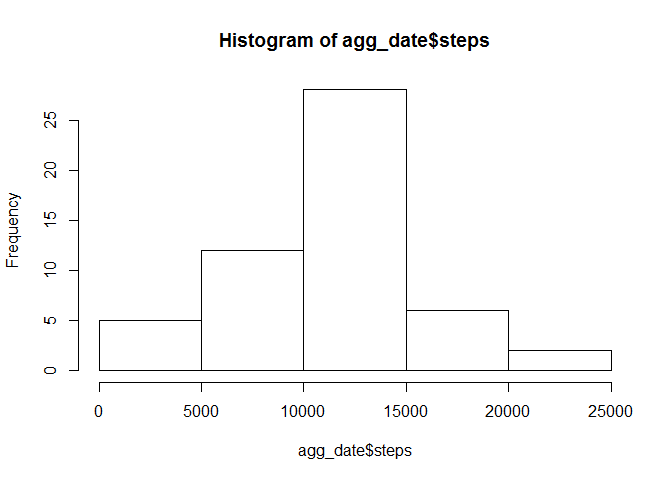
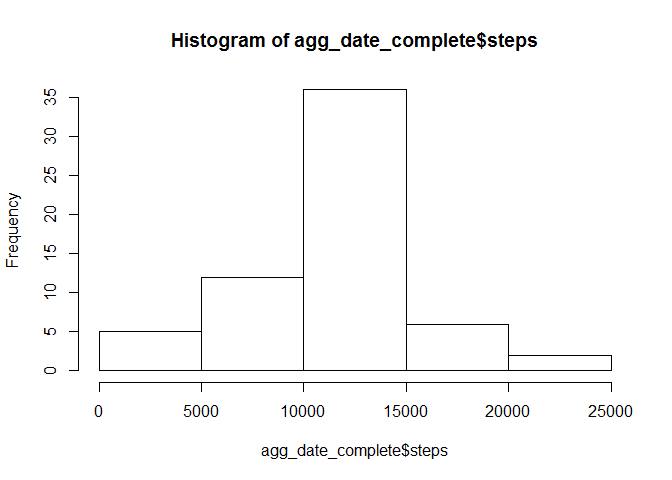
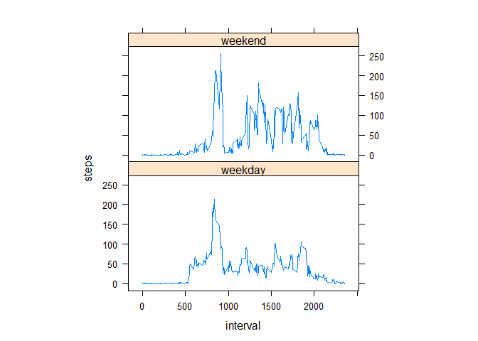

# Reproducible Research: Peer Assessment 1


## Loading and preprocessing the data

#### 1. Load the data


```r
activity <- read.csv("activity.csv", header = TRUE)
```

#### 2. Process/transform the data

Aggregate the activity data by date using the sum function:


```r
agg_date <- aggregate(steps ~ date, data = activity, FUN = sum, na.rm = TRUE)
```

And by interval using the mean function:


```r
agg_interval <- aggregate(steps ~ interval, data = activity, FUN = mean, na.rm = TRUE)
```

## What is mean total number of steps taken per day?

#### 1. Make a histogram of the total number of steps taken each day


```r
hist(agg_date$steps)
```

 

#### 2. Calculate and report the mean and median total number of steps taken per day


```r
mean(agg_date$steps, na.rm = TRUE)
```

```
## [1] 10766.19
```


```r
median(agg_date$steps, na.rm = TRUE)
```

```
## [1] 10765
```

## What is the average daily activity pattern?

#### 1. Make a time series plot (i.e. type = "l") of the 5-minute interval (x-axis) and the average number of steps taken, averaged across all days (y-axis)


```r
plot(steps ~ interval, data = agg_interval, type = "l")
```

 

#### 2. Which 5-minute interval, on average across all the days in the dataset, contains the maximum number of steps?


```r
agg_interval[which.max(agg_interval$steps), ]$interval
```

```
## [1] 835
```

## Imputing missing values

#### 1. Calculate and report the total number of missing values in the dataset 


```r
missing <- sum(!complete.cases(activity))
```

A total of 2304 rows have at least one missing value (one NA).

#### 2. Devise a strategy for filling in all of the missing values in the dataset. The strategy does not need to be sophisticated. For example, you could use the mean/median for that day, or the mean for that 5-minute interval, etc.

The strategy selected is: get the 5-minute interval steps from the aggregated by interval dataset:


```r
getStepsForInterval <- function(interval) {
  agg_interval[agg_interval$interval == interval, ]$steps
}
```

For example, getting the number of steps for the 25th interval from the aggregated
by interval dataset:


```r
getStepsForInterval(25)
```

```
## [1] 2.09434
```

#### 3. Create a new dataset that is equal to the original dataset but with the missing data filled in.

Start by copying the original dataset:


```r
activityComplete <- activity
```

And double check that the original missing values are present:


```r
sum(!complete.cases(activityComplete))
```

```
## [1] 2304
```

Fill in the missing values using the devised strategy


```r
for (i in 1:nrow(activityComplete)) {
    if (is.na(activityComplete[i, ]$steps)) {
        activityComplete[i, ]$steps <- getStepsForInterval(activityComplete[i, ]$interval)
    }
}
```

Check again for missing values:


```r
sum(!complete.cases(activityComplete))
```

```
## [1] 0
```

#### 4. Make a histogram of the total number of steps taken each day and Calculate and report the mean and median total number of steps taken per day. Do these values differ from the estimates from the first part of the assignment? What is the impact of imputing missing data on the estimates of the total daily number of steps?


```r
agg_date_complete <- aggregate(steps ~ date, data = activityComplete, sum)
hist(agg_date_complete$steps)
```

 


```r
mean(agg_date_complete$steps)
```

```
## [1] 10766.19
```


```r
median(agg_date_complete$steps)
```

```
## [1] 10766.19
```

The mean stays the same, and the media shifts slightly.

## Are there differences in activity patterns between weekdays and weekends?

#### 1. Create a new factor variable in the dataset with two levels - "weekday" and "weekend" indicating whether a given date is a weekday or weekend day.

First create a function that given a date in the dataset (a string), returns "weekday" of "weekend"
according to the given date.


```r
whichDay <- function(s) {
    d <- as.POSIXlt(as.Date(s))
    if (d$wday < 6) {
        return("weekday")
    }
    else {
        return("weekend")
    }
}
```

Create a vector of the results for processing the set of dates in the dataset, by appluing
the whichDay function to every date:


```r
weekdays <- sapply(activityComplete$date, FUN = whichDay)
```

Add the vector to the dataset as a factor:


```r
activityComplete$day <- factor(weekdays)
```

We can the new factor variabel with two levels (weekday and weekend):


```r
str(activityComplete)
```

```
## 'data.frame':	17568 obs. of  4 variables:
##  $ steps   : num  1.717 0.3396 0.1321 0.1509 0.0755 ...
##  $ date    : Factor w/ 61 levels "2012-10-01","2012-10-02",..: 1 1 1 1 1 1 1 1 1 1 ...
##  $ interval: int  0 5 10 15 20 25 30 35 40 45 ...
##  $ day     : Factor w/ 2 levels "weekday","weekend": 1 1 1 1 1 1 1 1 1 1 ...
```

#### 2. Make a panel plot containing a time series plot (i.e. type = "l") of the 5-minute interval (x-axis) and the average number of steps taken, averaged across all weekday days or weekend days (y-axis)

Aggregate the data steps by interval, using the day as factor, and the mean function:


```r
agg <- aggregate(steps ~ interval + day, activityComplete, mean)
```

Use the lattice base system:


```r
library(lattice)
```

Create the plot:

```r
xyplot(steps ~ interval | factor(day), data = agg, type = "l", aspect = 1/2)
```

 
